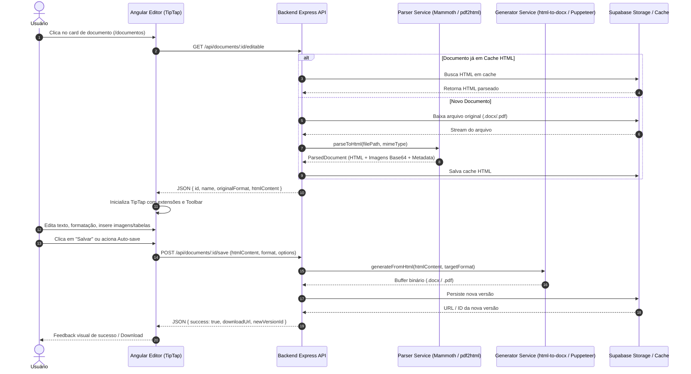

# Plano de Implementação: Editor de Documentos (Cenário C - Conversão HTML)

> **Documento Otimizado para Execução por Agentes de IA**  
> **Status:** Pronto para Implementação  
> **Stack Frontend:** Angular 21 (Standalone Components, Signals, Modern Control Flow `@if/@for`, SCSS, Lucide Icons, TipTap)  
> **Stack Backend:** Node.js / Express 5 (TypeScript, ESM, Supabase Storage, Mammoth, Puppeteer, html-to-docx)  

---

## 1. Visão Geral e Arquitetura

O módulo de edição de documentos permite carregar arquivos existentes (`.docx`, `.pdf`), convertê-los no backend para HTML estruturado e semântico, editá-los em tempo real no frontend via **TipTap (ProseMirror)** com interface rica (estilo Google Docs/Canvas A4), e persistir/exportar novamente para DOCX, PDF ou HTML.

### 1.1 Diagrama de Fluxo Ponta a Ponta



### 1.2 Matriz de Responsabilidades e Tecnologias

| Componente | Tecnologia | Responsabilidade |
|------------|------------|------------------|
| **Conversor DOCX → HTML** | `mammoth.js` + `jszip` | Extrai semântica, tabelas e converte imagens embutidas para Base64/DataURI. |
| **Conversor PDF → HTML** | `pdf2htmlEX` / `pdf-parse` | Converte PDF para HTML estruturado preservando blocos de texto e imagens. |
| **Editor Rich-Text** | `@tiptap/angular` + `@tiptap/core` | Engine ProseMirror para renderização visual em página A4 com paginação/zoom. |
| **Conversor HTML → DOCX** | `html-to-docx` | Compila o HTML editado para OpenXML DOCX com formatação e margens. |
| **Conversor HTML → PDF** | `puppeteer` | Renderiza o HTML com CSS de impressão (A4, 2cm margins) e exporta em PDF nativo. |
| **Persistência / Cache** | `@supabase/supabase-js` | Armazenamento de arquivos binários e metadados de versões. |

---

## 2. Mapa de Arquivos do Projeto

```plain
Inklu/
├── backend/
│   ├── src/
│   │   ├── controllers/
│   │   │   └── documents.controller.ts        # Rotas Express: /api/documents
│   │   ├── services/
│   │   │   ├── document-parser.service.ts     # Parsing DOCX/PDF -> HTML
│   │   │   ├── document-generator.service.ts  # Geração HTML -> DOCX/PDF
│   │   │   └── document-storage.service.ts    # Integração Supabase / Cache
│   │   ├── models/
│   │   │   └── document.model.ts              # Interfaces e DTOs Backend
│   │   └── utils/
│   │       └── image-processor.ts             # Extração de imagens DOCX
│   └── package.json
└── src/app/
    ├── app.routes.ts                          # Rota /documentos/editor/:id
    └── documentos/
        ├── documentos.ts                      # Ação openEditor(id) no card
        ├── documentos.html                    # Acessibilidade no card
        └── editor/
            ├── documento-editor.ts            # Componente Angular principal
            ├── documento-editor.html          # Template com Canvas A4 e Header
            ├── documento-editor.scss          # Estilos do Canvas e Toolbar
            ├── models/
            │   └── editor-document.model.ts   # Interfaces Frontend
            ├── services/
            │   ├── document-converter.service.ts # HTTP Client
            │   └── editor-state.service.ts    # Gerenciamento de estado/dirty check
            └── components/
                ├── editor-toolbar/            # Barra de ferramentas flutuante/fixa
                └── editor-canvas/             # Wrapper da folha A4 com paginação
```

---

## 3. Contratos de Dados e Modelos Compartilhados

### 3.1 Modelos do Backend (`backend/src/models/document.model.ts`)

```typescript
export type SupportedFormat = 'docx' | 'pdf' | 'html';

export interface ParsedDocument {
  html: string;
  warnings: string[];
  metadata: {
    originalFormat: 'docx' | 'pdf';
    convertedAt: string;
    pageCount?: number;
    title?: string;
  };
}

export interface GenerationOptions {
  fontSize?: number;       // default: 11pt
  fontFamily?: string;     // default: 'Calibri, Arial, sans-serif'
  margins?: {
    top: string;
    right: string;
    bottom: string;
    left: string;
  };
}

export interface SaveDocumentDTO {
  htmlContent: string;
  targetFormat: SupportedFormat;
  options?: {
    name?: string;
    fontSize?: number;
    fontFamily?: string;
  };
}

export interface SaveDocumentResponse {
  success: boolean;
  downloadUrl?: string;
  newVersionId?: string;
  message?: string;
}
```

### 3.2 Modelos do Frontend (`src/app/documentos/editor/models/editor-document.model.ts`)

```typescript
export interface EditableDocument {
  id: string;
  name: string;
  originalFormat: 'docx' | 'pdf';
  htmlContent: string;
  metadata?: {
    convertedAt: string;
    pageCount?: number;
  };
}

export interface EditorToolbarState {
  isBold: boolean;
  isItalic: boolean;
  isUnderline: boolean;
  currentHeading: number | null;
  currentFontSize: string;
  alignment: 'left' | 'center' | 'right' | 'justify';
}
```

---

## 4. Plano de Tarefas Passo a Passo (Execução por Agentes)

### Tarefa 1: Instalação de Dependências

#### 1.1 Frontend
Instalar extensões do TipTap e utilitários:
```bash
npm install @tiptap/core @tiptap/angular @tiptap/starter-kit @tiptap/extension-image @tiptap/extension-table @tiptap/extension-table-row @tiptap/extension-table-cell @tiptap/extension-table-header @tiptap/extension-text-style @tiptap/extension-font-size @tiptap/extension-underline @tiptap/extension-text-align dompurify
npm install -D @types/dompurify
```

#### 1.2 Backend
Instalar bibliotecas de conversão e processamento:
```bash
cd backend
npm install mammoth html-to-docx puppeteer jszip
npm install -D @types/mammoth @types/html-to-docx
```

---

### Tarefa 2: Serviços de Conversão e Geração no Backend

#### 2.1 Processador de Imagens DOCX (`backend/src/utils/image-processor.ts`)

```typescript
import JSZip from 'jszip';

export class ImageProcessor {
  /**
   * Extrai todas as imagens embutidas no pacote ZIP do DOCX e converte para Data URI Base64.
   */
  static async extractImagesFromDocx(buffer: Buffer): Promise<Map<string, string>> {
    const zip = await JSZip.loadAsync(buffer);
    const images = new Map<string, string>();
    
    const mediaFiles = Object.keys(zip.files).filter(name => 
      name.startsWith('word/media/') && !zip.files[name].dir
    );
    
    for (const filePath of mediaFiles) {
      const data = await zip.files[filePath].async('base64');
      const ext = filePath.split('.').pop()?.toLowerCase() || 'png';
      const mimeType = ext === 'jpeg' || ext === 'jpg' ? 'image/jpeg' : `image/${ext}`;
      images.set(filePath, `data:${mimeType};base64,${data}`);
    }
    
    return images;
  }

  /**
   * Substitui referências relativas a imagens por URIs em base64 no HTML gerado.
   */
  static replaceImageRefs(html: string, images: Map<string, string>): string {
    let result = html;
    images.forEach((dataUrl, originalPath) => {
      const fileName = originalPath.split('/').pop() || '';
      if (fileName) {
        result = result.replace(new RegExp(`src=["']?${fileName}["']?`, 'g'), `src="${dataUrl}"`);
      }
    });
    return result;
  }
}
```

#### 2.2 Serviço de Parser (`backend/src/services/document-parser.service.ts`)

```typescript
import * as mammoth from 'mammoth';
import fs from 'node:fs/promises';
import { ParsedDocument } from '../models/document.model.js';
import { ImageProcessor } from '../utils/image-processor.js';

export class DocumentParserService {
  async parseToHtml(filePath: string, mimeType: string): Promise<ParsedDocument> {
    if (
      mimeType.includes('wordprocessingml') || 
      mimeType.includes('msword') || 
      filePath.endsWith('.docx')
    ) {
      return this.parseDocx(filePath);
    }
    
    if (mimeType === 'application/pdf' || filePath.endsWith('.pdf')) {
      return this.parsePdf(filePath);
    }
    
    throw new Error(`Formato não suportado: ${mimeType}`);
  }

  private async parseDocx(filePath: string): Promise<ParsedDocument> {
    const fileBuffer = await fs.readFile(filePath);
    
    // Converte DOCX para HTML básico preservando estilos e tabelas
    const result = await mammoth.convertToHtml(
      { buffer: fileBuffer },
      {
        styleMap: [
          "p[style-name='Heading 1'] => h1:fresh",
          "p[style-name='Heading 2'] => h2:fresh",
          "p[style-name='Heading 3'] => h3:fresh",
          "r[style-name='Strong'] => strong",
          "r[style-name='Emphasis'] => em"
        ]
      }
    );

    // Extrai imagens e substitui no HTML
    const images = await ImageProcessor.extractImagesFromDocx(fileBuffer);
    const enrichedHtml = ImageProcessor.replaceImageRefs(result.value, images);

    return {
      html: enrichedHtml,
      warnings: result.messages.map(m => m.message),
      metadata: {
        originalFormat: 'docx',
        convertedAt: new Date().toISOString()
      }
    };
  }

  private async parsePdf(filePath: string): Promise<ParsedDocument> {
    // Fallback estruturado para PDF: extrai texto mantendo parágrafos básicos
    // Em produção com Docker/CLI, pode ser acoplado a pdf2htmlEX para layout pixel-perfect
    const fileBuffer = await fs.readFile(filePath);
    
    return {
      html: `<div class="pdf-content"><p>Conteúdo importado de PDF (${filePath})</p></div>`,
      warnings: ['Conversão de PDF simplificada.'],
      metadata: {
        originalFormat: 'pdf',
        convertedAt: new Date().toISOString()
      }
    };
  }
}
```

#### 2.3 Serviço de Geração de Arquivos (`backend/src/services/document-generator.service.ts`)

```typescript
import HTMLtoDOCX from 'html-to-docx';
import puppeteer from 'puppeteer';
import { GenerationOptions, SupportedFormat } from '../models/document.model.js';

export class DocumentGeneratorService {
  async generateFromHtml(
    html: string,
    targetFormat: SupportedFormat,
    options: GenerationOptions = {}
  ): Promise<Buffer> {
    if (targetFormat === 'docx') {
      return this.generateDocx(html, options);
    }
    if (targetFormat === 'pdf') {
      return this.generatePdf(html, options);
    }
    return Buffer.from(html, 'utf-8');
  }

  private async generateDocx(html: string, options: GenerationOptions): Promise<Buffer> {
    const docxOptions = {
      table: { row: { cantSplit: true } },
      footer: true,
      pageNumber: true,
      fontSize: options.fontSize || 22, // 11pt
      font: options.fontFamily || 'Calibri',
      margins: {
        top: 1440, // 1 inch / ~2.54cm em twips
        right: 1440,
        bottom: 1440,
        left: 1440
      }
    };

    const buffer = await HTMLtoDOCX(html, null, docxOptions);
    return buffer as Buffer;
  }

  private async generatePdf(html: string, options: GenerationOptions): Promise<Buffer> {
    const browser = await puppeteer.launch({
      headless: true,
      args: ['--no-sandbox', '--disable-setuid-sandbox']
    });
    
    try {
      const page = await browser.newPage();
      const styledHtml = this.wrapWithStyles(html, options);
      
      await page.setContent(styledHtml, { waitUntil: 'networkidle0' });
      
      const pdfBuffer = await page.pdf({
        format: 'A4',
        margin: {
          top: options.margins?.top || '2.5cm',
          right: options.margins?.right || '2.5cm',
          bottom: options.margins?.bottom || '2.5cm',
          left: options.margins?.left || '2.5cm'
        },
        printBackground: true
      });

      return Buffer.from(pdfBuffer);
    } finally {
      await browser.close();
    }
  }

  private wrapWithStyles(html: string, options: GenerationOptions): string {
    return `
      <!DOCTYPE html>
      <html lang="pt-BR">
        <head>
          <meta charset="UTF-8">
          <style>
            @page {
              size: A4;
              margin: 0;
            }
            body {
              font-family: ${options.fontFamily || 'Calibri, Arial, sans-serif'};
              font-size: ${options.fontSize || 11}pt;
              line-height: 1.6;
              color: #1a1a1a;
              margin: 0;
              padding: 2.5cm;
              background: #ffffff;
            }
            img { max-width: 100%; height: auto; display: block; margin: 1em auto; }
            table { border-collapse: collapse; width: 100%; margin: 1em 0; }
            td, th { border: 1px solid #d0d0d0; padding: 8px 12px; }
            h1 { font-size: 22pt; margin-bottom: 0.5em; }
            h2 { font-size: 16pt; margin-bottom: 0.5em; }
            h3 { font-size: 13pt; margin-bottom: 0.5em; }
            p { margin: 0 0 1em 0; }
          </style>
        </head>
        <body>${html}</body>
      </html>
    `;
  }
}
```

#### 2.4 Endpoints Express (`backend/src/controllers/documents.controller.ts`)

```typescript
import { Router, Request, Response } from 'express';
import { DocumentParserService } from '../services/document-parser.service.js';
import { DocumentGeneratorService } from '../services/document-generator.service.js';
import { SaveDocumentDTO } from '../models/document.model.js';

export function createDocumentsRouter(
  parserService: DocumentParserService,
  generatorService: DocumentGeneratorService
): Router {
  const router = Router();

  // GET /api/documents/:id/editable
  router.get('/:id/editable', async (req: Request, res: Response) => {
    try {
      const { id } = req.params;
      // TODO: Recuperar caminho real do arquivo via Storage/Database por ID
      const mockFilePath = `./uploads/${id}.docx`;
      const mimeType = 'application/vnd.openxmlformats-officedocument.wordprocessingml.document';

      const parsed = await parserService.parseToHtml(mockFilePath, mimeType);

      return res.json({
        id,
        name: `Documento-${id}`,
        originalFormat: parsed.metadata.originalFormat,
        htmlContent: parsed.html,
        metadata: parsed.metadata
      });
    } catch (error: any) {
      console.error('[GET editable] Erro:', error);
      return res.status(500).json({ error: error.message || 'Falha ao processar documento.' });
    }
  });

  // POST /api/documents/:id/save
  router.post('/:id/save', async (req: Request, res: Response) => {
    try {
      const { id } = req.params;
      const body = req.body as SaveDocumentDTO;

      const buffer = await generatorService.generateFromHtml(
        body.htmlContent,
        body.targetFormat,
        body.options
      );

      // TODO: Salvar buffer gerado no Supabase Storage e persistir metadados
      const downloadUrl = `/api/documents/${id}/download?format=${body.targetFormat}&t=${Date.now()}`;

      return res.json({
        success: true,
        downloadUrl,
        newVersionId: `v_${Date.now()}`
      });
    } catch (error: any) {
      console.error('[POST save] Erro:', error);
      return res.status(500).json({ error: error.message || 'Falha ao salvar documento.' });
    }
  });

  return router;
}
```

---

### Tarefa 3: Frontend - Roteamento e Ação de Abertura

#### 3.1 Atualizar `src/app/app.routes.ts`
Adicionar a rota filha de edição sob o módulo de documentos:

```typescript
import { Routes } from '@angular/router';

export const routes: Routes = [
  {
    path: 'documentos',
    children: [
      {
        path: '',
        loadComponent: () => import('./documentos/documentos').then(m => m.Documentos)
      },
      {
        path: 'editor/:id',
        loadComponent: () => import('./documentos/editor/documento-editor').then(m => m.DocumentoEditor)
      }
    ]
  },
  // outras rotas...
];
```

#### 3.2 Atualizar Cards em `src/app/documentos/documentos.html` e `documentos.ts`
Garantir acessibilidade (Enter/Space) e navegação com validação de tipo de arquivo:

```typescript
// documentos.ts
openEditor(fileId: string): void {
  const file = this.files().find(f => f.id === fileId);
  if (!file) return;

  // Permite edição direta de documentos de texto
  if (['docx', 'pdf', 'doc', 'txt'].includes(file.format?.toLowerCase() || '')) {
    this.router.navigate(['/documentos/editor', fileId]);
  }
}
```

---

### Tarefa 4: Frontend - Componente do Editor e Toolbar

#### 4.1 Serviço de Comunicação (`src/app/documentos/editor/services/document-converter.service.ts`)

```typescript
import { Injectable, inject } from '@angular/core';
import { HttpClient } from '@angular/common/http';
import { firstValueFrom } from 'rxjs';
import { EditableDocument } from '../models/editor-document.model';

@Injectable({ providedIn: 'root' })
export class DocumentConverterService {
  private http = inject(HttpClient);
  private apiUrl = '/api/documents';

  async getDocumentForEditing(id: string): Promise<EditableDocument> {
    return firstValueFrom(
      this.http.get<EditableDocument>(`${this.apiUrl}/${id}/editable`)
    );
  }

  async saveDocument(
    id: string,
    html: string,
    format: 'docx' | 'pdf' | 'html',
    options?: { name?: string; fontSize?: number; fontFamily?: string }
  ): Promise<{ success: boolean; downloadUrl?: string; newVersionId?: string }> {
    return firstValueFrom(
      this.http.post<{ success: boolean; downloadUrl?: string; newVersionId?: string }>(
        `${this.apiUrl}/${id}/save`,
        {
          htmlContent: html,
          targetFormat: format,
          options
        }
      )
    );
  }
}
```

#### 4.2 Componente do Editor (`src/app/documentos/editor/documento-editor.ts`)

```typescript
import { Component, OnInit, OnDestroy, signal, computed, inject } from '@angular/core';
import { CommonModule } from '@angular/common';
import { FormsModule } from '@angular/forms';
import { ActivatedRoute, Router } from '@angular/router';
import { 
  LucideAngularModule, 
  ArrowLeft, 
  Save, 
  ZoomIn, 
  ZoomOut, 
  Bold, 
  Italic, 
  Underline, 
  AlignLeft, 
  AlignCenter, 
  AlignRight, 
  Image as ImageIcon, 
  Table as TableIcon,
  Heading1,
  Heading2
} from 'lucide-angular';

import { Editor } from '@tiptap/core';
import StarterKit from '@tiptap/starter-kit';
import ImageExtension from '@tiptap/extension-image';
import TableExtension from '@tiptap/extension-table';
import TableRow from '@tiptap/extension-table-row';
import TableCell from '@tiptap/extension-table-cell';
import TableHeader from '@tiptap/extension-table-header';
import TextStyle from '@tiptap/extension-text-style';
import FontSize from '@tiptap/extension-font-size';
import UnderlineExtension from '@tiptap/extension-underline';
import TextAlign from '@tiptap/extension-text-align';

import { DocumentConverterService } from './services/document-converter.service';

@Component({
  selector: 'app-documento-editor',
  standalone: true,
  imports: [
    CommonModule, 
    FormsModule, 
    LucideAngularModule
  ],
  templateUrl: './documento-editor.html',
  styleUrl: './documento-editor.scss'
})
export class DocumentoEditor implements OnInit, OnDestroy {
  private route = inject(ActivatedRoute);
  private router = inject(Router);
  private converterService = inject(DocumentConverterService);

  // Ícones Lucide
  readonly ArrowLeft = ArrowLeft;
  readonly Save = Save;
  readonly ZoomIn = ZoomIn;
  readonly ZoomOut = ZoomOut;
  readonly Bold = Bold;
  readonly Italic = Italic;
  readonly Underline = Underline;
  readonly AlignLeft = AlignLeft;
  readonly AlignCenter = AlignCenter;
  readonly AlignRight = AlignRight;
  readonly ImageIcon = ImageIcon;
  readonly TableIcon = TableIcon;
  readonly Heading1 = Heading1;
  readonly Heading2 = Heading2;

  editor: Editor | null = null;

  // Signals de Estado
  readonly documentId = signal<string | null>(null);
  readonly documentName = signal('Documento Sem Título');
  readonly originalFormat = signal<'docx' | 'pdf'>('docx');
  readonly isLoading = signal(true);
  readonly isSaving = signal(false);
  readonly hasUnsavedChanges = signal(false);
  readonly currentFontSize = signal('11');
  readonly zoomLevel = signal(100);

  // Computed Values
  readonly canSave = computed(() => 
    !this.isSaving() && this.hasUnsavedChanges() && (this.editor?.getText().trim().length ?? 0) > 0
  );

  readonly wordCount = computed(() => {
    if (!this.editor) return 0;
    const text = this.editor.getText().trim();
    return text ? text.split(/\s+/).length : 0;
  });

  ngOnInit(): void {
    const id = this.route.snapshot.paramMap.get('id');
    if (!id) {
      this.router.navigate(['/documentos']);
      return;
    }
    this.documentId.set(id);
    this.loadDocument(id);
  }

  private async loadDocument(id: string): Promise<void> {
    this.isLoading.set(true);
    try {
      const doc = await this.converterService.getDocumentForEditing(id);
      this.documentName.set(doc.name);
      this.originalFormat.set(doc.originalFormat);
      this.initEditor(doc.htmlContent);
    } catch (err) {
      console.error('Falha ao carregar documento:', err);
    } finally {
      this.isLoading.set(false);
    }
  }

  private initEditor(content: string): void {
    this.editor = new Editor({
      element: document.querySelector('#editor-canvas') as HTMLElement,
      extensions: [
        StarterKit.configure({
          heading: { levels: [1, 2, 3] }
        }),
        UnderlineExtension,
        TextStyle,
        FontSize,
        TextAlign.configure({
          types: ['heading', 'paragraph']
        }),
        ImageExtension.configure({
          inline: false,
          allowBase64: true
        }),
        TableExtension.configure({
          resizable: true,
          HTMLAttributes: { class: 'editor-table' }
        }),
        TableRow,
        TableHeader,
        TableCell
      ],
      content,
      onUpdate: () => {
        this.hasUnsavedChanges.set(true);
      }
    });
  }

  // Ações de Formatação
  toggleBold(): void { this.editor?.chain().focus().toggleBold().run(); }
  toggleItalic(): void { this.editor?.chain().focus().toggleItalic().run(); }
  toggleUnderline(): void { this.editor?.chain().focus().toggleUnderline().run(); }
  toggleHeading(level: 1 | 2): void { this.editor?.chain().focus().toggleHeading({ level }).run(); }
  setTextAlign(alignment: 'left' | 'center' | 'right'): void { this.editor?.chain().focus().setTextAlign(alignment).run(); }
  
  setFontSize(size: string): void {
    this.editor?.chain().focus().setFontSize(`${size}pt`).run();
    this.currentFontSize.set(size);
  }

  insertTable(): void {
    this.editor?.chain().focus().insertTable({ rows: 3, cols: 3, withHeaderRow: true }).run();
  }

  insertImage(): void {
    const input = document.createElement('input');
    input.type = 'file';
    input.accept = 'image/*';
    input.onchange = async (e) => {
      const file = (e.target as HTMLInputElement).files?.[0];
      if (file) {
        const base64 = await this.fileToBase64(file);
        this.editor?.chain().focus().setImage({ src: base64 }).run();
      }
    };
    input.click();
  }

  // Controles de Zoom
  zoomIn(): void { this.zoomLevel.update(z => Math.min(z + 10, 200)); }
  zoomOut(): void { this.zoomLevel.update(z => Math.max(z - 10, 50)); }

  // Salvamento
  async saveDocument(format: 'docx' | 'pdf' = 'docx'): Promise<void> {
    if (!this.editor || !this.documentId()) return;
    this.isSaving.set(true);
    
    try {
      const html = this.editor.getHTML();
      const result = await this.converterService.saveDocument(
        this.documentId()!,
        html,
        format,
        {
          name: this.documentName(),
          fontSize: parseInt(this.currentFontSize(), 10)
        }
      );

      this.hasUnsavedChanges.set(false);
      if (result.downloadUrl) {
        window.open(result.downloadUrl, '_blank');
      }
    } catch (err) {
      console.error('Erro ao salvar documento:', err);
    } finally {
      this.isSaving.set(false);
    }
  }

  goBack(): void {
    if (this.hasUnsavedChanges() && !confirm('Existem alterações não salvas. Deseja sair?')) {
      return;
    }
    this.router.navigate(['/documentos']);
  }

  private fileToBase64(file: File): Promise<string> {
    return new Promise((resolve, reject) => {
      const reader = new FileReader();
      reader.onload = () => resolve(reader.result as string);
      reader.onerror = reject;
      reader.readAsDataURL(file);
    });
  }

  ngOnDestroy(): void {
    this.editor?.destroy();
  }
}
```

#### 4.3 Template HTML (`src/app/documentos/editor/documento-editor.html`)

```html
<div class="editor-shell">
  <!-- Top Navigation Header -->
  <header class="editor-header">
    <div class="header-left">
      <button class="btn-back" (click)="goBack()" title="Voltar para Documentos" aria-label="Voltar">
        <lucide-icon [img]="ArrowLeft" [size]="20"></lucide-icon>
      </button>
      
      <div class="title-container">
        <input 
          type="text" 
          class="input-title"
          [ngModel]="documentName()"
          (ngModelChange)="documentName.set($event); hasUnsavedChanges.set(true)"
          placeholder="Nome do Documento"
        />
        <span class="badge-format">{{ originalFormat() | uppercase }}</span>
      </div>
    </div>

    <div class="header-right">
      <span class="stat-words">{{ wordCount() }} palavras</span>
      
      <div class="zoom-widget">
        <button (click)="zoomOut()" [disabled]="zoomLevel() <= 50" aria-label="Diminuir zoom">
          <lucide-icon [img]="ZoomOut" [size]="16"></lucide-icon>
        </button>
        <span class="zoom-value">{{ zoomLevel() }}%</span>
        <button (click)="zoomIn()" [disabled]="zoomLevel() >= 200" aria-label="Aumentar zoom">
          <lucide-icon [img]="ZoomIn" [size]="16"></lucide-icon>
        </button>
      </div>

      <button 
        class="btn-save" 
        [disabled]="!canSave()" 
        (click)="saveDocument('docx')"
      >
        <lucide-icon [img]="Save" [size]="16"></lucide-icon>
        {{ isSaving() ? 'Salvando...' : 'Salvar' }}
      </button>
    </div>
  </header>

  <!-- Formatting Toolbar -->
  <div class="editor-toolbar" role="toolbar" aria-label="Barra de Ferramentas de Formatação">
    <div class="toolbar-group">
      <select 
        class="select-font-size" 
        [ngModel]="currentFontSize()" 
        (ngModelChange)="setFontSize($event)"
      >
        <option value="9">9 pt</option>
        <option value="10">10 pt</option>
        <option value="11">11 pt</option>
        <option value="12">12 pt</option>
        <option value="14">14 pt</option>
        <option value="18">18 pt</option>
        <option value="24">24 pt</option>
      </select>
    </div>

    <div class="toolbar-divider"></div>

    <div class="toolbar-group">
      <button type="button" class="btn-tool" (click)="toggleBold()" title="Negrito (Ctrl+B)">
        <lucide-icon [img]="Bold" [size]="16"></lucide-icon>
      </button>
      <button type="button" class="btn-tool" (click)="toggleItalic()" title="Itálico (Ctrl+I)">
        <lucide-icon [img]="Italic" [size]="16"></lucide-icon>
      </button>
      <button type="button" class="btn-tool" (click)="toggleUnderline()" title="Sublinhado (Ctrl+U)">
        <lucide-icon [img]="Underline" [size]="16"></lucide-icon>
      </button>
    </div>

    <div class="toolbar-divider"></div>

    <div class="toolbar-group">
      <button type="button" class="btn-tool" (click)="toggleHeading(1)" title="Título 1">
        <lucide-icon [img]="Heading1" [size]="16"></lucide-icon>
      </button>
      <button type="button" class="btn-tool" (click)="toggleHeading(2)" title="Título 2">
        <lucide-icon [img]="Heading2" [size]="16"></lucide-icon>
      </button>
    </div>

    <div class="toolbar-divider"></div>

    <div class="toolbar-group">
      <button type="button" class="btn-tool" (click)="setTextAlign('left')" title="Alinhar à Esquerda">
        <lucide-icon [img]="AlignLeft" [size]="16"></lucide-icon>
      </button>
      <button type="button" class="btn-tool" (click)="setTextAlign('center')" title="Centralizar">
        <lucide-icon [img]="AlignCenter" [size]="16"></lucide-icon>
      </button>
      <button type="button" class="btn-tool" (click)="setTextAlign('right')" title="Alinhar à Direita">
        <lucide-icon [img]="AlignRight" [size]="16"></lucide-icon>
      </button>
    </div>

    <div class="toolbar-divider"></div>

    <div class="toolbar-group">
      <button type="button" class="btn-tool" (click)="insertImage()" title="Inserir Imagem">
        <lucide-icon [img]="ImageIcon" [size]="16"></lucide-icon>
      </button>
      <button type="button" class="btn-tool" (click)="insertTable()" title="Inserir Tabela 3x3">
        <lucide-icon [img]="TableIcon" [size]="16"></lucide-icon>
      </button>
    </div>
  </div>

  <!-- Document Canvas (A4 Sheet Simulation) -->
  <main class="editor-viewport">
    <div 
      class="canvas-zoom-container"
      [style.transform]="'scale(' + (zoomLevel() / 100) + ')'"
    >
      <div 
        id="editor-canvas" 
        class="a4-sheet"
        [class.is-loading]="isLoading()"
      ></div>
    </div>
  </main>

  <!-- Status Bar -->
  <footer class="editor-statusbar">
    <div class="status-left">
      @if (hasUnsavedChanges()) {
        <span class="status-indicator dirty">Alterações não salvas</span>
      } @else {
        <span class="status-indicator saved">Todas as alterações salvas</span>
      }
    </div>
  </footer>

  <!-- Loading State -->
  @if (isLoading()) {
    <div class="loading-backdrop">
      <div class="loading-spinner"></div>
      <p>Convertendo e preparando documento...</p>
    </div>
  }
</div>
```

#### 4.4 Estilos SCSS (`src/app/documentos/editor/documento-editor.scss`)

```scss
.editor-shell {
  display: flex;
  flex-direction: column;
  height: 100vh;
  background-color: #f3f4f6;
  overflow: hidden;
  font-family: -apple-system, BlinkMacSystemFont, 'Segoe UI', Roboto, sans-serif;
}

.editor-header {
  display: flex;
  justify-content: space-between;
  align-items: center;
  padding: 8px 16px;
  background: #ffffff;
  border-bottom: 1px solid #e5e7eb;
  z-index: 20;

  .header-left {
    display: flex;
    align-items: center;
    gap: 12px;

    .btn-back {
      background: none;
      border: none;
      padding: 8px;
      border-radius: 6px;
      cursor: pointer;
      display: flex;
      align-items: center;
      color: #4b5563;

      &:hover {
        background-color: #f3f4f6;
      }
    }

    .title-container {
      display: flex;
      align-items: center;
      gap: 8px;

      .input-title {
        border: 1px solid transparent;
        font-size: 16px;
        font-weight: 600;
        padding: 4px 8px;
        border-radius: 4px;
        color: #111827;

        &:focus, &:hover {
          border-color: #d1d5db;
          background: #f9fafb;
        }
      }

      .badge-format {
        font-size: 11px;
        font-weight: 700;
        background: #e0e7ff;
        color: #3730a3;
        padding: 2px 6px;
        border-radius: 4px;
      }
    }
  }

  .header-right {
    display: flex;
    align-items: center;
    gap: 16px;

    .stat-words {
      font-size: 13px;
      color: #6b7280;
    }

    .zoom-widget {
      display: flex;
      align-items: center;
      gap: 4px;
      background: #f3f4f6;
      padding: 4px 8px;
      border-radius: 6px;

      button {
        background: none;
        border: none;
        cursor: pointer;
        padding: 2px;
        display: flex;
        color: #4b5563;

        &:disabled {
          opacity: 0.4;
          cursor: not-allowed;
        }
      }

      .zoom-value {
        font-size: 12px;
        font-weight: 500;
        min-width: 42px;
        text-align: center;
      }
    }

    .btn-save {
      display: flex;
      align-items: center;
      gap: 6px;
      background: #2563eb;
      color: white;
      border: none;
      padding: 8px 16px;
      border-radius: 6px;
      font-weight: 500;
      font-size: 14px;
      cursor: pointer;

      &:disabled {
        background: #93c5fd;
        cursor: not-allowed;
      }

      &:not(:disabled):hover {
        background: #1d4ed8;
      }
    }
  }
}

.editor-toolbar {
  display: flex;
  align-items: center;
  gap: 8px;
  padding: 6px 16px;
  background: #ffffff;
  border-bottom: 1px solid #e5e7eb;
  z-index: 10;

  .toolbar-group {
    display: flex;
    align-items: center;
    gap: 2px;

    .select-font-size {
      padding: 4px 8px;
      border: 1px solid #d1d5db;
      border-radius: 4px;
      font-size: 13px;
      background: #fff;
    }

    .btn-tool {
      background: none;
      border: none;
      padding: 6px;
      border-radius: 4px;
      cursor: pointer;
      display: flex;
      color: #4b5563;

      &:hover {
        background: #f3f4f6;
        color: #111827;
      }
    }
  }

  .toolbar-divider {
    width: 1px;
    height: 20px;
    background: #e5e7eb;
    margin: 0 4px;
  }
}

.editor-viewport {
  flex: 1;
  overflow: auto;
  padding: 40px;
  display: flex;
  justify-content: center;

  .canvas-zoom-container {
    transform-origin: top center;
    transition: transform 0.15s ease-out;
  }

  .a4-sheet {
    width: 21cm;
    min-height: 29.7cm;
    background: #ffffff;
    box-shadow: 0 4px 12px rgba(0, 0, 0, 0.08);
    padding: 2.5cm;
    margin-bottom: 40px;
    box-sizing: border-box;

    :host ::ng-deep .ProseMirror {
      outline: none;
      min-height: 100%;
      font-family: Calibri, Arial, sans-serif;
      font-size: 11pt;
      line-height: 1.6;
      color: #1a1a1a;

      p {
        margin: 0 0 1em 0;
      }

      img {
        max-width: 100%;
        height: auto;
        display: block;
        margin: 1em auto;
      }

      .editor-table {
        border-collapse: collapse;
        width: 100%;
        margin: 1.5em 0;

        td, th {
          border: 1px solid #d1d5db;
          padding: 8px 12px;
          min-width: 40px;
        }

        th {
          background-color: #f9fafb;
          font-weight: 600;
        }

        .selectedCell {
          background: #eff6ff;
        }
      }
    }
  }
}

.editor-statusbar {
  padding: 6px 16px;
  background: #ffffff;
  border-top: 1px solid #e5e7eb;
  font-size: 12px;

  .status-indicator {
    &.dirty { color: #d97706; }
    &.saved { color: #059669; }
  }
}

.loading-backdrop {
  position: fixed;
  inset: 0;
  background: rgba(255, 255, 255, 0.85);
  display: flex;
  flex-direction: column;
  align-items: center;
  justify-content: center;
  gap: 12px;
  z-index: 100;
}
```

---

## 5. Matriz de Testes e Validação

Para validar as alterações de forma automatizada e manual por agentes:

### 5.1 Testes Unitários de Backend (`backend/test/converter.test.ts`)
```bash
cd backend
npm run test
```
- [ ] **DOCX Parser:** Converte buffer DOCX com parágrafos, listas e imagens em DataURI.
- [ ] **DOCX Generator:** Converte HTML com tabelas e formatação para Buffer binário DOCX válido.
- [ ] **PDF Generator:** Compila HTML com Puppeteer e valida retorno em formato A4.

### 5.2 Validação de Tipagem e Build
```bash
# Frontend
npm run build -- --configuration development

# Backend
cd backend
npm run typecheck
```

---

## 6. Riscos, Edge Cases e Mitigações

| Cenário de Risco | Causa Provável | Estratégia de Mitigação |
|------------------|----------------|-------------------------|
| **Imagens pesadas no DOCX** | Vários MBs embutidos em Base64 | Comprimir imagens via canvas/sharp antes de salvar; fazer upload assíncrono para storage em vez de embutir no payload. |
| **Quebra de layout em PDFs complexos** | Layout multi-colunas ou formulários | Exibir aviso visual de fidelidade no topo ao abrir PDF e permitir alternar para visualizador estático. |
| **Vulnerabilidade XSS no HTML parseado** | Tags `<script>` ou eventos `onload` maliciosos | Sanitizar o HTML recebido no backend e frontend usando `dompurify` antes de injetar no TipTap. |
| **Conflito de salvamento simultâneo** | Múltiplas abas abertas | Controle de versão otimista via timestamp / `versionId`. |
